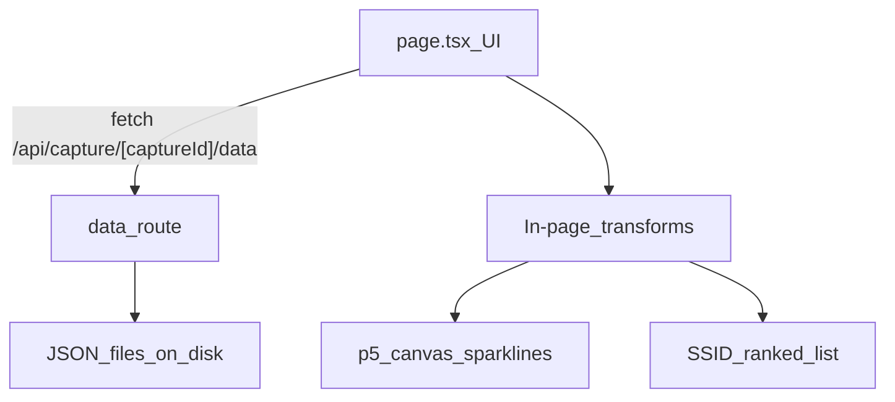

# Manufacturer + Probe SSID Dashboard (Next + p5)

## Outcome
Run `app-who` and get a single-page dashboard that answers:
- **Who dominates?** (manufacturer totals)
- **When do they appear?** (per-bin manufacturer trend)
- **What SSIDs do their clients probe?** (per-manufacturer probe SSID ranking)

Constraints:
- **Few files**: keep code consolidated; only break out files if the page becomes unwieldy.
- **Data loading**: **Next route handler** reads JSON from disk (no giant client bundle).
- **SSID display**: show **raw SSIDs** (plain text only).

## Data inputs (current capture)
Capture folder: `../20260331/` (relative to `app-who`).

- `20260331/manufacturer_stats.json`
  - `manufacturers[]`: `{ manufacturer, count, avg_signal, total_bytes, avg_bytes }`
- `20260331/timeline_activity.json`
  - `bin_minutes`, `timeline[]`
  - `timeline[i].manufacturers`: `{ [manufacturer]: count }`
- `20260331/devices_searching.json`
  - array of devices with `manufacturer` + `searching_for_networks[]`

## Minimal file plan (recommended)
Keep it to **2–3 new files total** inside `app-who/src/app/`:

1) **One API route** returning everything needed for the page
- File: `app-who/src/app/api/capture/[captureId]/data/route.ts`
- `GET /api/capture/20260331/data` returns:
  - `manufacturerStats` (from `manufacturer_stats.json`)
  - `timelineActivity` (from `timeline_activity.json`)
  - `devicesSearching` (from `devices_searching.json`)
  - plus small derived metadata: `captureId`, `binMinutes`, `totalBins`

2) **One page** that does UI + transforms + p5 sketch (initially)
- File: `app-who/src/app/page.tsx`
- Responsibilities:
  - fetch `/api/capture/[captureId]/data`
  - compute:
    - `topManufacturers` (top 25 by `count`)
    - `seriesByManufacturer`: map manufacturer → counts across bins
    - `ssidCountsForSelected`: SSID → count (devices or occurrences)
  - render:
    - left: manufacturer list/table with counts + sparkline per row
    - right: selected manufacturer SSID ranked list

3) (Optional) If `page.tsx` gets too big, split **one** component
- File: `app-who/src/app/ManufacturerTrends.client.tsx` (client component that owns selection + p5 rendering)

## Visualization details
### View 1: Manufacturer rank + trend
- Use `manufacturer_stats.manufacturers[]` for totals.
- For each manufacturer row, sparkline values come from:
  - `timeline_activity.timeline[].manufacturers[manufacturer] ?? 0`

Implementation note (p5):
- Prefer **one canvas** drawing all sparklines (fast, fewer DOM nodes).
- Table rows remain normal HTML for selection/click.

### View 2: Probe SSIDs (raw)
For selected manufacturer:
- Filter devices: `device.manufacturer === selected`
- Flatten `searching_for_networks[]`
- Count either:
  - **devicesCount**: how many distinct devices probe SSID at least once, or
  - **occurrencesCount**: total occurrences across all devices (including repeats)

Start with **devicesCount** (more “honest” than spamming repeats).

## Capture switching (optional but easy)
Add a small dropdown at top of page:
- `captureId` defaults to `20260331`
- later: add `GET /api/captures` to list available capture folders

## Quick run checklist
- `npm install`
- `npm run dev`
- Open the page and verify:
  - top manufacturer counts match `20260331/manufacturer_stats.json`
  - sparklines change over time bins (not flat for active manufacturers)
  - selecting a manufacturer updates SSID ranking

## Data flow

